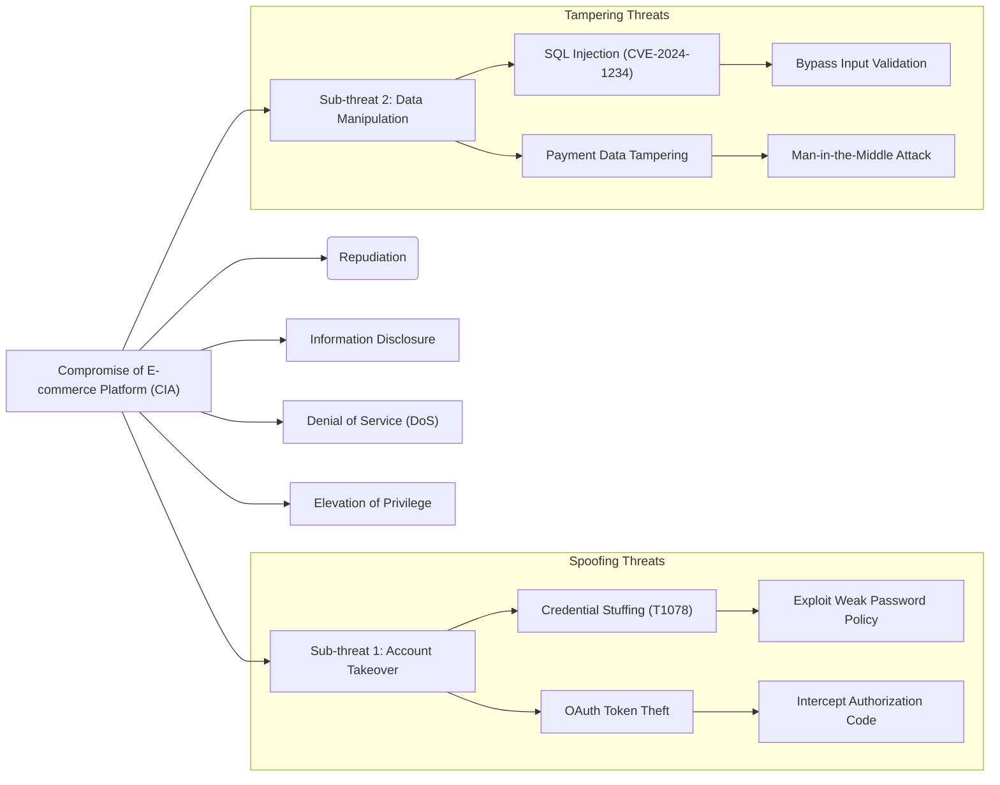

## Overview

The Attack Tree API provides functions to generate comprehensive attack trees in Mermaid syntax based on threat models, MITRE ATT&CK techniques, and vulnerability data.

## Configuration Constants

```python
DEFAULT_MODEL_NAME = "gpt-4o"
MERMAID_CODE_BLOCK_PATTERN = r"^```mermaid\s*|\s*```$"
```

## Functions

### get_attack_tree()

Generate a comprehensive attack tree using OpenAI's API based on application details and threat intelligence.

```python
def get_attack_tree(
    api_key: str, 
    model_name: str | None = None, 
    prompt: str | None = None
) -> str
```

<ParamField path="api_key" type="str" required>
  OpenAI API key for authentication
</ParamField>

<ParamField path="model_name" type="str | None" default="gpt-4o">
  Name of the OpenAI model to use. Defaults to `DEFAULT_MODEL_NAME` ("gpt-4o") if not specified
</ParamField>

<ParamField path="prompt" type="str | None" required>
  Formatted prompt containing application details, threat data, and vulnerability information. Created using `create_attack_tree_prompt()`
</ParamField>

<ResponseField name="attack_tree" type="str">
  Generated attack tree in Mermaid graph syntax, ready for rendering
</ResponseField>

**Example Usage:**

```python
from attack_tree import get_attack_tree, create_attack_tree_prompt

# Create the prompt with application details
prompt = create_attack_tree_prompt(
    app_type="Web application",
    authentication="OAuth2, MFA",
    internet_facing="Yes",
    sensitive_data="PII, Payment Card Data",
    mitre_data="T1078: Valid Accounts, T1190: Exploit Public-Facing Application",
    nvd_vulnerabilities="CVE-2024-1234: SQL Injection in login form",
    otx_vulnerabilities="Recent credential stuffing campaigns targeting financial sector",
    app_input="E-commerce platform with user accounts and payment processing"
)

# Generate attack tree
attack_tree = get_attack_tree(
    api_key="your-api-key",
    model_name="gpt-4o",
    prompt=prompt
)

print(attack_tree)
```

**Output Format:**

The function returns Mermaid syntax for a hierarchical attack tree:



**Attack Tree Structure:**

The generated attack tree follows STRIDE methodology:
- **Root node**: Overall compromise goal (CIA: Confidentiality, Integrity, Availability)
- **Primary branches**: STRIDE categories (Spoofing, Tampering, Repudiation, Information Disclosure, DoS, Elevation of Privilege)
- **Subgraphs**: Grouped related threats for better readability
- **Multiple levels**: Detailed threat hierarchy with specific attack vectors
- **MITRE references**: Includes relevant MITRE ATT&CK technique IDs where applicable
- **CVE references**: Incorporates known vulnerabilities from NVD data

**Exceptions:**

- `ValueError`: Raised if API key or prompt is empty
- `Exception`: Raised for API call errors or response processing failures
- All exceptions handled by `error_handler.handle_exception()`

---

### create_attack_tree_prompt()

Create a comprehensive prompt for generating an attack tree based on application details and threat intelligence.

```python
def create_attack_tree_prompt(
    app_type: str,
    authentication: str,
    internet_facing: str,
    sensitive_data: str,
    mitre_data: str,
    nvd_vulnerabilities: str,
    otx_vulnerabilities: str,
    app_input: str,
) -> str
```

<ParamField path="app_type" type="str" required>
  Type of application (e.g., "Web application", "Mobile application", "IoT application", "ICS or SCADA System")
</ParamField>

<ParamField path="authentication" type="str" required>
  Authentication methods used by the application (e.g., "OAuth2, JWT", "SAML", "Basic Auth", "MFA")
</ParamField>

<ParamField path="internet_facing" type="str" required>
  Whether the application is exposed to the internet ("Yes" or "No")
</ParamField>

<ParamField path="sensitive_data" type="str" required>
  Types of sensitive data handled by the application (e.g., "PII", "PHI", "Payment Card Data", "Intellectual Property")
</ParamField>

<ParamField path="mitre_data" type="str" required>
  MITRE ATT&CK techniques and tactics relevant to the threat model. Should include technique IDs and descriptions.
</ParamField>

<ParamField path="nvd_vulnerabilities" type="str" required>
  Known vulnerabilities from the National Vulnerability Database (NVD) relevant to technologies used in the application
</ParamField>

<ParamField path="otx_vulnerabilities" type="str" required>
  Threat intelligence data from AlienVault OTX relevant to the industry sector or application type
</ParamField>

<ParamField path="app_input" type="str" required>
  Detailed description of the application, its functionality, architecture, and components
</ParamField>

<ResponseField name="prompt" type="str">
  Formatted prompt string ready to be sent to `get_attack_tree()`
</ResponseField>

**Example Usage:**

```python
from attack_tree import create_attack_tree_prompt

prompt = create_attack_tree_prompt(
    app_type="Cloud application",
    authentication="SAML 2.0, Multi-factor Authentication",
    internet_facing="Yes",
    sensitive_data="Customer PII, Financial transactions, Authentication tokens",
    mitre_data="""
    T1078 (Valid Accounts): Adversaries may obtain valid credentials
    T1190 (Exploit Public-Facing Application): Exploiting web vulnerabilities
    T1566 (Phishing): Social engineering to obtain credentials
    T1550 (Use Alternate Authentication Material): Token theft and replay
    """,
    nvd_vulnerabilities="""
    CVE-2024-1234: SQL Injection in authentication module (CVSS: 9.8)
    CVE-2024-5678: XML External Entity vulnerability in API (CVSS: 8.6)
    """,
    otx_vulnerabilities="""
    Recent phishing campaigns targeting cloud service users
    Credential stuffing attacks using leaked database credentials
    API key exposure in public repositories
    """,
    app_input="""
    A multi-tenant SaaS application providing financial analytics.
    Components include:
    - React frontend hosted on AWS CloudFront
    - REST API on AWS Lambda + API Gateway
    - PostgreSQL database on AWS RDS
    - Redis cache for session management
    - S3 for document storage
    - Integration with third-party payment processor
    """
)

print(prompt)
```

**Prompt Structure:**

The generated prompt includes:
1. Application type and characteristics
2. Authentication mechanisms
3. Internet exposure status
4. Sensitive data types
5. Application description and architecture
6. STRIDE threats mapped to MITRE ATT&CK
7. Known vulnerabilities from NVD
8. Threat intelligence from AlienVault OTX

---

## System Prompt

The `get_attack_tree()` function uses a detailed system prompt that instructs the AI to:

1. Act as a cybersecurity expert with 20+ years of experience
2. Use STRIDE threat modeling methodology
3. Create multi-level attack tree hierarchies
4. Use subgraphs to group related threats
5. Include MITRE ATT&CK technique references
6. Follow proper Mermaid syntax conventions
7. Wrap labels with special characters in double quotes

**Important Mermaid Syntax Rules:**

- Round brackets `()` are special characters in Mermaid
- Labels containing parentheses must be wrapped in double quotes
- Example: `["Example Node Label (ENL)"]` ✓
- Example: `[Example Node Label (ENL)]` ✗

---

## Output Processing

The function automatically:

1. Receives response from OpenAI API
2. Extracts the message content
3. Removes Markdown code block delimiters (` ```mermaid ` and ` ``` `)
4. Returns clean Mermaid syntax

**Regex Pattern Used:**

```python
MERMAID_CODE_BLOCK_PATTERN = r"^```mermaid\s*|\s*```$"
```

---

## Integration Example

Complete workflow for generating an attack tree:

```python
from attack_tree import get_attack_tree, create_attack_tree_prompt
from threat_model import get_threat_model, create_threat_model_prompt
from mitre_attack import fetch_mitre_attack_data, process_mitre_attack_data

# Step 1: Generate threat model
threat_prompt = create_threat_model_prompt(
    app_type="Web application",
    authentication="OAuth2",
    internet_facing="Yes",
    industry_sector="Healthcare",
    sensitive_data="PHI",
    app_input="Patient portal for viewing medical records",
    nvd_vulnerabilities="CVE-2024-1234: Auth bypass",
    otx_data="Healthcare ransomware campaigns",
    technical_ability="Medium"
)

threat_model_response = get_threat_model(
    api_key="your-api-key",
    model_name="gpt-4o",
    prompt=threat_prompt
)

# Step 2: Map to MITRE ATT&CK
stix_data = fetch_mitre_attack_data("Web application")
mitre_mapped = process_mitre_attack_data(
    stix_data=stix_data,
    threat_model=threat_model_response["threat_model"],
    app_details={...},
    openai_api_key="your-api-key"
)

# Step 3: Format MITRE data for attack tree
mitre_data_str = "\n".join([
    f"{item['mitre_techniques'][0]['technique_id']}: {item['mitre_techniques'][0]['name']}"
    for item in mitre_mapped if item['mitre_techniques']
])

# Step 4: Generate attack tree
attack_tree_prompt = create_attack_tree_prompt(
    app_type="Web application",
    authentication="OAuth2",
    internet_facing="Yes",
    sensitive_data="PHI",
    mitre_data=mitre_data_str,
    nvd_vulnerabilities="CVE-2024-1234: Auth bypass",
    otx_vulnerabilities="Healthcare ransomware campaigns",
    app_input="Patient portal for viewing medical records"
)

attack_tree = get_attack_tree(
    api_key="your-api-key",
    model_name="gpt-4o",
    prompt=attack_tree_prompt
)

# Step 5: Render the attack tree (using a Mermaid renderer)
print(attack_tree)
```

---

## Error Handling

All functions use centralized error handling via `error_handler.handle_exception()` for consistent logging and error reporting.

**Common Errors:**

- Empty API key or prompt: `ValueError`
- API call failures: `Exception` with descriptive message
- Invalid response format: Handled gracefully with logging
