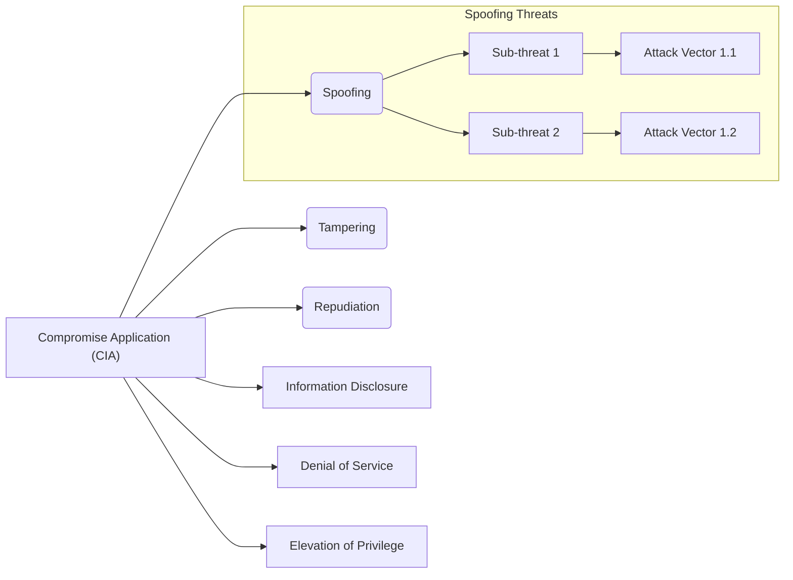
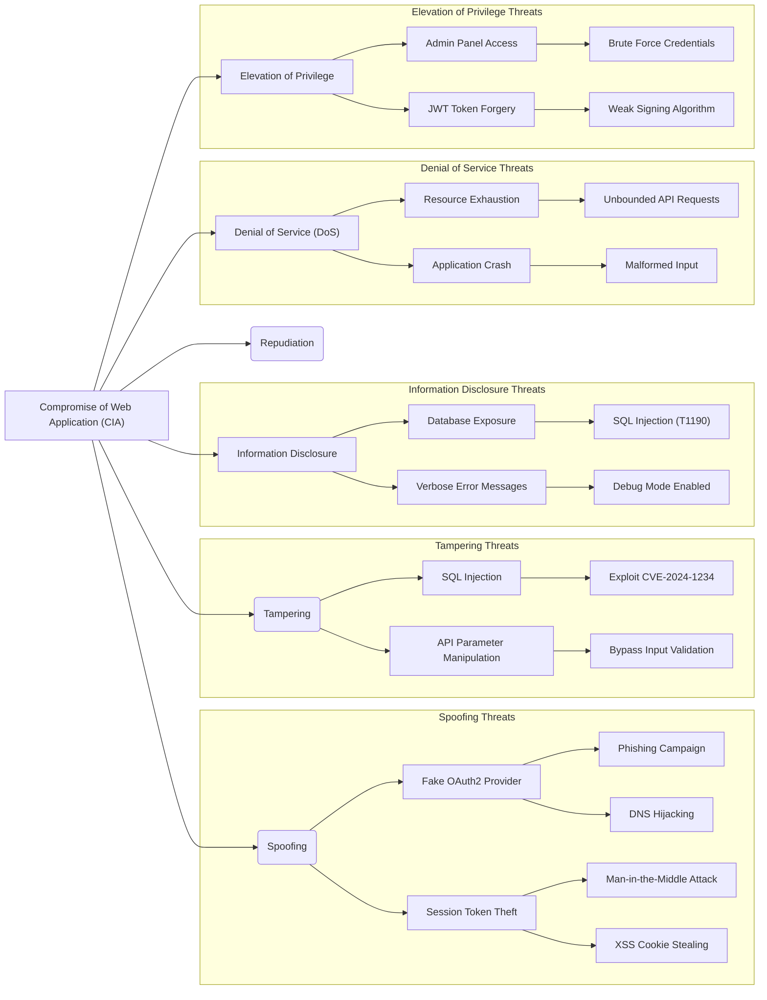

# Attack Trees

AegisShield generates comprehensive attack trees that visualize hierarchical relationships between threats, sub-threats, and attack vectors using Mermaid diagram syntax.

## Overview

The attack tree module (`attack_tree.py`) creates structured visual representations of how an attacker might compromise your system, organizing threats into a tree structure based on the STRIDE methodology.

<CardGroup cols={3}>
  <Card title="Mermaid Syntax" icon="diagram-project">
    Industry-standard graph visualization
  </Card>
  <Card title="STRIDE Structure" icon="shield-halved">
    Organized by 6 threat categories
  </Card>
  <Card title="Multi-Level" icon="sitemap">
    Threats → Sub-threats → Attack vectors
  </Card>
</CardGroup>

## Attack Tree Structure

Attack trees are organized hierarchically:



<Note>
The root node represents compromise of Confidentiality, Integrity, and Availability (CIA triad).
</Note>

## Core Functions

### get_attack_tree()

Generates an attack tree using OpenAI's API.

<ParamField path="api_key" type="str" required>
  OpenAI API key
</ParamField>

<ParamField path="model_name" type="str" default="gpt-4o">
  OpenAI model to use
</ParamField>

<ParamField path="prompt" type="str" required>
  Formatted attack tree prompt
</ParamField>

**Returns:** `str` - Mermaid diagram code (cleaned of markdown fences)

```python attack_tree.py:65-213
from attack_tree import get_attack_tree, create_attack_tree_prompt

# Create prompt
prompt = create_attack_tree_prompt(
    app_type="Web application",
    authentication="OAuth2, MFA",
    internet_facing="Yes",
    sensitive_data="PII, Financial",
    mitre_data=mitre_markdown,
    nvd_vulnerabilities=nvd_data,
    otx_vulnerabilities=otx_data,
    app_input="Banking application..."
)

# Generate attack tree
attack_tree_code = get_attack_tree(
    api_key=openai_key,
    model_name="gpt-4o",
    prompt=prompt
)

# Display in Streamlit
import streamlit as st
st.markdown(f"```mermaid\n{attack_tree_code}\n```")
```

### create_attack_tree_prompt()

Creates a comprehensive prompt with application details and threat intelligence.

<ParamField path="app_type" type="str" required>
  Application type
</ParamField>

<ParamField path="authentication" type="str" required>
  Authentication methods
</ParamField>

<ParamField path="internet_facing" type="str" required>
  Internet exposure
</ParamField>

<ParamField path="sensitive_data" type="str" required>
  Data sensitivity level
</ParamField>

<ParamField path="mitre_data" type="str" required>
  MITRE ATT&CK mappings
</ParamField>

<ParamField path="nvd_vulnerabilities" type="str" required>
  NVD CVE data
</ParamField>

<ParamField path="otx_vulnerabilities" type="str" required>
  AlienVault OTX data
</ParamField>

<ParamField path="app_input" type="str" required>
  Application description
</ParamField>

```python Prompt creation from attack_tree.py:17-61
prompt = create_attack_tree_prompt(
    app_type="Web application",
    authentication="OAuth2, Multi-factor",
    internet_facing="Yes",
    sensitive_data="PII, Financial records",
    mitre_data="T1566: Phishing, T1078: Valid Accounts...",
    nvd_vulnerabilities="CVE-2024-1234: SQL Injection...",
    otx_vulnerabilities="Banking Trojan activity...",
    app_input="Online banking platform with..."
)
```

## Mermaid Syntax Rules

AegisShield generates Mermaid diagrams following specific syntax rules:

<Accordion title="Node Types" icon="circle-nodes">
  - **Square brackets `[]`**: Standard nodes
  - **Round parentheses `()`**: Rounded nodes
  - **Double quotes `"`**: Required for labels with special characters
  
  ```mermaid
  A[Standard Node]
  B(Rounded Node)
  C["Node with (parentheses)"]
  ```
</Accordion>

<Accordion title="Special Characters" icon="bracket-square">
  **Critical Rule:** Round brackets `()` are special characters in Mermaid. Always wrap labels containing parentheses in double quotes.
  
  ```mermaid
  A["Denial of Service (DoS)"]
  B["Compromise Application (CIA)"]
  ```
  
  <Warning>
  Failing to quote labels with parentheses will cause rendering errors.
  </Warning>
</Accordion>

<Accordion title="Subgraphs" icon="object-group">
  Group related threats for better readability:
  
  ```mermaid
  subgraph "Spoofing Threats"
      B[Spoofing]
      B --> B1[Threat 1]
      B --> B2[Threat 2]
  end
  ```
</Accordion>

<Accordion title="Arrows" icon="arrow-right">
  - `-->` : Standard arrow
  - `-.->` : Dotted arrow
  - `==>` : Thick arrow
  
  ```mermaid
  A --> B
  B -.-> C
  C ==> D
  ```
</Accordion>

## System Prompt

The AI uses a detailed system prompt (from `attack_tree.py:99-193`):

```text Key instructions
Act as a cyber security expert with more than 20 years of experience using the STRIDE 
threat modelling methodology to produce comprehensive threat models for a wide range of 
applications. Your task is to use the application description provided to you to produce 
an attack tree in Mermaid syntax.

The attack tree should reflect the potential threats for the application based on all 
the details given. You should create multiple levels in the tree to capture the hierarchy 
of threats and sub-threats, ensuring a very detailed and comprehensive representation of 
the attack scenarios. Use subgraphs to group related threats for better readability.

You MUST only respond with the Mermaid code block.

IMPORTANT: Round brackets are special characters in Mermaid syntax. If you want to use 
round brackets inside a node label you MUST wrap the label in double quotes. 
For example, ["Example Node Label (ENL)"].
```

## Output Processing

The module automatically cleans the output:

```python Regex cleaning from attack_tree.py:205-207
import re

# Remove markdown code block fences
attack_tree_code = re.sub(
    r"^```mermaid\s*|\s*```$", 
    "", 
    attack_tree_code, 
    flags=re.MULTILINE
)
```

This removes:
- Opening ` ```mermaid ` fence
- Closing ` ``` ` fence
- Leading/trailing whitespace

## Example Output

A typical attack tree for a web application:



## Integration with Threat Intelligence

Attack trees incorporate:

- **STRIDE threats**: From threat model
- **MITRE ATT&CK techniques**: Referenced by ID (e.g., T1190)
- **NVD CVEs**: Referenced by ID (e.g., CVE-2024-1234)
- **AlienVault OTX**: Industry-specific threats

<Tip>
Notice how the example includes "SQL Injection (T1190)" and "Exploit CVE-2024-1234" - real references from threat intelligence sources.
</Tip>

## Rendering Options

<Tabs>
  <Tab title="Streamlit">
    ```python
    import streamlit as st
    
    st.markdown(f"```mermaid\n{attack_tree_code}\n```")
    ```
  </Tab>
  
  <Tab title="Markdown">
    ```markdown
    ```mermaid
    graph LR
        A[Root] --> B[Child]
    ```
    ```
  </Tab>
  
  <Tab title="HTML">
    ```html
    <div class="mermaid">
    graph LR
        A[Root] --> B[Child]
    </div>
    <script src="https://cdn.jsdelivr.net/npm/mermaid/dist/mermaid.min.js"></script>
    ```
  </Tab>
</Tabs>

## Use Cases

<CardGroup cols={2}>
  <Card title="Security Reviews" icon="magnifying-glass">
    Visual representation helps security teams quickly understand attack paths and prioritize defenses.
  </Card>
  
  <Card title="Developer Training" icon="graduation-cap">
    Teach developers about potential attack vectors and secure coding practices.
  </Card>
  
  <Card title="Executive Presentations" icon="presentation">
    Non-technical stakeholders can grasp security threats through visual diagrams.
  </Card>
  
  <Card title="Compliance Documentation" icon="file-certificate">
    Include attack trees in security documentation for audits and assessments.
  </Card>
</CardGroup>

## Complete Workflow

```python End-to-end attack tree generation
from threat_model import get_threat_model
from mitre_attack import process_mitre_attack_data
from nvd_search import search_nvd
from alientvault_search import fetch_otx_data
from attack_tree import create_attack_tree_prompt, get_attack_tree

# 1. Gather all inputs
threats = get_threat_model(...)
mitre_mapped = process_mitre_attack_data(...)
nvd_data = search_nvd(...)
otx_data = fetch_otx_data(...)

# 2. Format data for prompt
mitre_markdown = format_mitre_data(mitre_mapped)

# 3. Create attack tree prompt
prompt = create_attack_tree_prompt(
    app_type=app_type,
    authentication=auth_methods,
    internet_facing=internet_facing,
    sensitive_data=data_sensitivity,
    mitre_data=mitre_markdown,
    nvd_vulnerabilities=nvd_data,
    otx_vulnerabilities=otx_data,
    app_input=app_description
)

# 4. Generate attack tree
attack_tree = get_attack_tree(
    api_key=openai_key,
    model_name="gpt-4o",
    prompt=prompt
)

# 5. Display or save
print(f"```mermaid\n{attack_tree}\n```")
```

## Best Practices

<Accordion title="Detailed Descriptions" icon="file-lines">
  Provide comprehensive application descriptions. More detail leads to more accurate and specific attack trees.
</Accordion>

<Accordion title="Include Threat Intelligence" icon="database">
  Always include MITRE, NVD, and OTX data in the prompt. Real-world intelligence produces realistic attack paths.
</Accordion>

<Accordion title="Review and Refine" icon="pen">
  Generated attack trees may need manual refinement for your specific environment. Use them as a starting point.
</Accordion>

<Accordion title="Update Regularly" icon="rotate">
  Regenerate attack trees when:
  - Architecture changes
  - New vulnerabilities are disclosed
  - Threat landscape evolves
  - New features are added
</Accordion>

## Related Features

- [Threat Modeling](/features/threat-modeling) - Generate STRIDE threats
- [MITRE ATT&CK](/features/mitre-attack) - Map to attack techniques  
- [Risk Assessment](/features/risk-assessment) - DREAD scoring
- [PDF Reports](/workflows/pdf-reports) - Export attack trees to PDF
