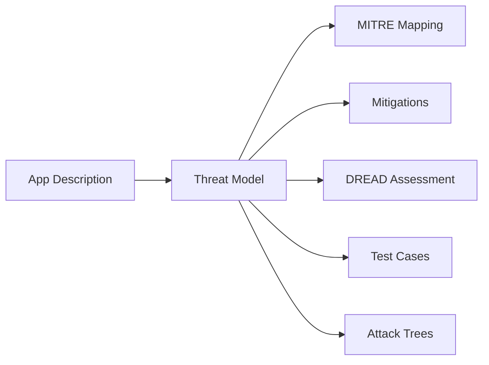

# Threat Modeling

AegisShield's core threat modeling engine leverages GPT-4o to generate comprehensive STRIDE-based threat models tailored to your application. The system combines AI-powered analysis with real-time threat intelligence from multiple sources.

## Overview

The threat modeling module (`threat_model.py`) provides three primary capabilities:

<CardGroup cols={3}>
  <Card title="Threat Generation" icon="brain">
    AI-powered STRIDE threat identification
  </Card>
  <Card title="Image Analysis" icon="image">
    Architecture diagram analysis using vision models
  </Card>
  <Card title="Prompt Engineering" icon="wand-magic-sparkles">
    Sophisticated prompts for 20+ years of expertise
  </Card>
</CardGroup>

## STRIDE Methodology

AegisShield implements the STRIDE threat modeling framework:

- **S**poofing - Identity impersonation attacks
- **T**ampering - Data or code modification
- **R**epudiation - Denial of actions performed
- **I**nformation Disclosure - Unauthorized data access
- **D**enial of Service - Service disruption
- **E**levation of Privilege - Unauthorized access elevation

<Note>
The system generates **3 threats per STRIDE category** (18 total) by default, ensuring comprehensive coverage across all threat types.
</Note>

## Core Functions

### get_threat_model()

Generates a complete threat model using OpenAI's API.

<ParamField path="api_key" type="str" required>
  OpenAI API key for authentication
</ParamField>

<ParamField path="model_name" type="str" required>
  OpenAI model to use (typically "gpt-4o")
</ParamField>

<ParamField path="prompt" type="str" required>
  Formatted threat modeling prompt
</ParamField>

**Returns:** `dict[str, Any]` - JSON object containing:
- `threat_model`: Array of identified threats
- `improvement_suggestions`: Recommendations for better descriptions

```python threat_model.py
from threat_model import get_threat_model

# Generate threat model
response = get_threat_model(
    api_key="your-openai-key",
    model_name="gpt-4o",
    prompt=threat_prompt
)

# Access threats
threats = response["threat_model"]
suggestions = response["improvement_suggestions"]
```

### create_threat_model_prompt()

Creates a comprehensive prompt incorporating application details and threat intelligence.

<ParamField path="app_type" type="str" required>
  Application type (e.g., "Web application")
</ParamField>

<ParamField path="authentication" type="str" required>
  Authentication methods used
</ParamField>

<ParamField path="internet_facing" type="str" required>
  Whether application is internet-facing
</ParamField>

<ParamField path="industry_sector" type="str" required>
  Industry sector (e.g., "Finance")
</ParamField>

<ParamField path="sensitive_data" type="str" required>
  Types of sensitive data handled
</ParamField>

<ParamField path="app_input" type="str" required>
  Detailed application description
</ParamField>

<ParamField path="nvd_vulnerabilities" type="str" required>
  NVD CVE data for technology stack
</ParamField>

<ParamField path="otx_data" type="str" required>
  AlienVault OTX threat intelligence
</ParamField>

<ParamField path="technical_ability" type="str" required>
  User's technical level (Low/Medium/High)
</ParamField>

```python Example usage
from threat_model import create_threat_model_prompt

prompt = create_threat_model_prompt(
    app_type="Web application",
    authentication="OAuth2, MFA",
    internet_facing="Yes",
    industry_sector="Finance",
    sensitive_data="PII, Financial records",
    app_input="Banking application with...",
    nvd_vulnerabilities=nvd_results,
    otx_data=otx_results,
    technical_ability="Medium"
)
```

### get_image_analysis()

Analyzes architecture diagrams using GPT-4 Vision.

<ParamField path="api_key" type="str" required>
  OpenAI API key
</ParamField>

<ParamField path="model_name" type="str" required>
  Vision model (e.g., "gpt-4o")
</ParamField>

<ParamField path="prompt" type="str" required>
  Analysis prompt
</ParamField>

<ParamField path="base64_image" type="str" required>
  Base64-encoded image data
</ParamField>

```python Image analysis example
from threat_model import get_image_analysis, create_image_analysis_prompt
import base64

# Load and encode image
with open("architecture.png", "rb") as f:
    image_data = base64.b64encode(f.read()).decode()

# Analyze
analysis = get_image_analysis(
    api_key=api_key,
    model_name="gpt-4o",
    prompt=create_image_analysis_prompt(),
    base64_image=image_data
)

description = analysis["choices"][0]["message"]["content"]
```

## Threat Model Structure

Each threat in the model includes:

```json Threat structure
{
  "Threat Type": "Spoofing",
  "Scenario": "An attacker could...",
  "Assumptions": [
    {
      "Assumption": "API keys are stored in plaintext",
      "Role": "Developer",
      "Condition": "No key management system"
    }
  ],
  "Potential Impact": "Unauthorized access to...",
  "MITRE ATT&CK Keywords": [
    "credential access",
    "token theft",
    "api abuse"
  ]
}
```

<Accordion title="Understanding Assumptions">
Assumptions document the conditions that must be true for a threat to be realized:

- **Assumption**: What must be true
- **Role**: Who is responsible (Developer, Admin, User)
- **Condition**: When it applies

This helps prioritize threats based on your actual environment.
</Accordion>

## Error Handling

The module implements robust error handling:

```python Retry logic from threat_model.py
def retry_with_backoff(func, max_retries: int = 3, initial_delay: float = 1.0):
    """Retry with exponential backoff."""
    delay = initial_delay
    
    for attempt in range(max_retries):
        try:
            return func()
        except (RequestException, Timeout) as e:
            if attempt < max_retries - 1:
                logger.warning(f"Attempt {attempt + 1} failed. Retrying in {delay}s...")
                time.sleep(delay)
                delay *= 2  # Exponential backoff
            else:
                raise ThreatModelAPIError(f"Failed after {max_retries} attempts")
```

<Warning>
API calls may fail due to rate limits or network issues. The retry logic with exponential backoff (1s, 2s, 4s) helps ensure reliability.
</Warning>

## Output Format

The threat model is converted to Markdown for display:

```python json_to_markdown() usage
from threat_model import json_to_markdown

markdown = json_to_markdown(
    threat_model=threats,
    improvement_suggestions=suggestions
)

# Renders as Markdown table
print(markdown)
```

**Output:**

| Threat Type | Scenario | Potential Impact | Assumptions |
|-------------|----------|------------------|-------------|
| Spoofing | An attacker could... | Unauthorized access... | - Assumption 1 (Role, Condition) |

## Best Practices

<CardGroup cols={2}>
  <Card title="Detailed Descriptions" icon="file-lines">
    Provide comprehensive application descriptions with architecture details, data flows, and authentication mechanisms for better threat identification.
  </Card>
  
  <Card title="Include Context" icon="diagram-project">
    Upload architecture diagrams when available - visual analysis enhances threat detection accuracy.
  </Card>
  
  <Card title="Specify Tech Stack" icon="layer-group">
    Accurate technology selection enables CVE-specific threat identification from NVD.
  </Card>
  
  <Card title="Review Assumptions" icon="clipboard-check">
    Validate assumptions against your actual environment to prioritize relevant threats.
  </Card>
</CardGroup>

## Integration

The threat model feeds into downstream processes:



<Tip>
See [MITRE ATT&CK Integration](/features/mitre-attack) for how threats are mapped to techniques and [Risk Assessment](/features/risk-assessment) for DREAD scoring.
</Tip>

## Related Functions

- [process_mitre_attack_data()](/api/mitre-attack) - Maps threats to techniques
- [get_mitigations()](/api/mitigations) - Generates mitigation strategies
- [get_dread_assessment()](/api/dread) - Produces risk scores
- [get_test_cases()](/api/test-cases) - Creates security test cases
