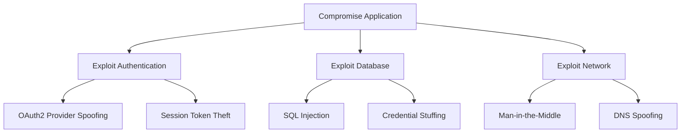

# Interpreting Threat Model Results

AegisShield generates comprehensive threat intelligence across multiple dimensions. This guide helps you understand each component of the output and how to use it effectively.

## Threat Model Structure

When you click "Generate Threat Model" in Step 3, AegisShield creates a multi-layered analysis:

1. **Improvement Suggestions** - Recommendations to enhance your application description
2. **STRIDE Threat Model** - Categorized threats across all six STRIDE categories
3. **Attack Tree** - Visual representation of attack paths
4. **MITRE ATT&CK Mapping** - Tactics, techniques, and procedures (TTPs)
5. **NVD Vulnerabilities** - Known CVEs from the National Vulnerability Database
6. **AlienVault OTX Data** - Industry-specific threat intelligence

## Understanding Improvement Suggestions

The first section provides feedback on your application description. From `step3_threat_model.py:222-226`:

```markdown
### Improvement Suggestions
- Specify the exact version of the OAuth2 library used
- Clarify whether the application uses session-based or token-based authentication
- Describe the network segmentation between frontend and backend
```

**How to use these:**
- Update your Step 1 description with the suggested details
- Regenerate the threat model for more precise results
- These suggestions help AegisShield provide more targeted threats

<Tip>
  If you see many improvement suggestions, your initial description may be too vague. Consider going back to Step 1 and adding more detail before proceeding.
</Tip>

## STRIDE Threat Model

The core threat model is organized using the STRIDE methodology. Each threat includes:

### Threat Model Format

From `threat_model.py:66-88`, threats are displayed in a table:

| Threat Type | Scenario | Potential Impact | Assumptions |
|-------------|----------|------------------|-------------|
| Spoofing | An attacker could create a fake OAuth2 provider and trick users into logging in through it. | Unauthorized access to user accounts, data theft, credential compromise | - **Assumption**: Users don't verify the OAuth2 provider URL (Role: End User, Condition: Lack of security awareness)<br/>- **Assumption**: The application doesn't implement OAuth2 state parameter validation (Role: Developer, Condition: Incomplete implementation) |

### Threat Categories (STRIDE)

<Steps>
  <Step title="Spoofing">
    **Identity-based threats** where attackers impersonate users, systems, or services.
    
    **Common scenarios:**
    - Fake authentication providers
    - Man-in-the-Middle attacks intercepting credentials
    - Session token theft and replay
    - DNS spoofing to redirect traffic
    
    **Look for:** Authentication weaknesses, credential handling, identity verification
  </Step>

  <Step title="Tampering">
    **Data integrity threats** where attackers modify data or code.
    
    **Common scenarios:**
    - SQL injection modifying database records
    - Parameter tampering in API requests
    - Malicious code injection in uploaded files
    - Configuration file modification
    
    **Look for:** Input validation, data integrity checks, access controls
  </Step>

  <Step title="Repudiation">
    **Accountability threats** where actions can't be traced back to users.
    
    **Common scenarios:**
    - Missing audit logs for sensitive operations
    - Log file tampering or deletion
    - Unsigned transactions
    - Non-repudiable actions
    
    **Look for:** Logging gaps, audit trail weaknesses, digital signature requirements
  </Step>

  <Step title="Information Disclosure">
    **Confidentiality threats** where sensitive data is exposed.
    
    **Common scenarios:**
    - API responses leaking sensitive data
    - Error messages revealing system details
    - Unencrypted data transmission
    - Excessive permissions exposing data
    
    **Look for:** Data exposure risks, encryption gaps, overly verbose errors
  </Step>

  <Step title="Denial of Service">
    **Availability threats** where systems become unavailable.
    
    **Common scenarios:**
    - Resource exhaustion attacks
    - Rate limiting bypass
    - Algorithmic complexity attacks
    - Distributed denial of service (DDoS)
    
    **Look for:** Resource limits, rate limiting, input size restrictions
  </Step>

  <Step title="Elevation of Privilege">
    **Authorization threats** where attackers gain unauthorized access levels.
    
    **Common scenarios:**
    - Privilege escalation through API manipulation
    - Insecure direct object references (IDOR)
    - JWT token manipulation
    - Path traversal to access admin functions
    
    **Look for:** Authorization checks, role validation, privilege boundaries
  </Step>
</Steps>

### Understanding Assumptions

Each threat includes assumptions that must be true for the threat to materialize. From `threat_model.py:73-81`:

**Assumption structure:**
- **Assumption**: The specific condition that must exist
- **Role**: Who is responsible (Developer, User, Admin, Attacker)
- **Condition**: When this assumption holds true

**Example:**
```markdown
- **Assumption**: The application uses default database credentials 
  (Role: Developer, Condition: Poor security practices during deployment)
- **Assumption**: The database is accessible from the internet 
  (Role: System Administrator, Condition: Misconfigured firewall rules)
```

<Note>
  Pay special attention to assumptions where the Role is "Developer" or "System Administrator" - these represent risks you can directly control and mitigate.
</Note>

## Attack Tree Visualization

The attack tree provides a visual representation of how threats can be exploited. From `step3_threat_model.py:259-293`, AegisShield generates a Mermaid diagram:



**How to read attack trees:**
- **Root node**: The attacker's ultimate goal
- **Branches**: Alternative attack paths
- **Leaf nodes**: Specific attack techniques
- **Paths**: Sequences of steps an attacker might take

<Tip>
  Attack trees help prioritize mitigations. Focus first on nodes that:
  1. Have multiple paths leading to them (critical chokepoints)
  2. Are easier to exploit (low Exploitability in DREAD)
  3. Lead directly to the root goal (shortest attack path)
</Tip>

## MITRE ATT&CK Mapping

AegisShield maps each threat to the MITRE ATT&CK framework. From `step3_threat_model.py:236-256`, the output includes:

```markdown
### Threat: Spoofing
**Scenario**: An attacker could create a fake OAuth2 provider...
**Potential Impact**: Unauthorized access to user accounts...

#### MITRE ATT&CK Techniques
**Name**: Valid Accounts
- **URL**: https://attack.mitre.org/techniques/T1078/
- **Technique ID**: T1078
- **Attack Pattern ID**: attack-pattern--b17a1a56-e99c-403c-8948-561df0cffe81

**Name**: Man-in-the-Middle
- **URL**: https://attack.mitre.org/techniques/T1557/
- **Technique ID**: T1557
- **Attack Pattern ID**: attack-pattern--3257eb21-f9a7-4430-8de1-d8b6e288f529
```

### MITRE ATT&CK Components

<Steps>
  <Step title="Technique Name">
    Human-readable name for the attack technique.
    
    **Examples:** Valid Accounts, Phishing, Brute Force, SQL Injection
  </Step>

  <Step title="Technique ID">
    Unique identifier in the ATT&CK framework (format: T####).
    
    **Use this to:**
    - Search for real-world examples on the MITRE ATT&CK website
    - Find detection rules and signatures
    - Research defense strategies
  </Step>

  <Step title="ATT&CK URL">
    Direct link to the technique documentation.
    
    **Contains:**
    - Detailed technique description
    - Examples from real attacks
    - Detection methods
    - Mitigation strategies
  </Step>

  <Step title="Attack Pattern ID">
    STIX identifier for the technique (used in threat intelligence sharing).
  </Step>
</Steps>

### How AegisShield Maps to MITRE

From `step3_threat_model.py:69-76`, the mapping process:

1. Fetches STIX data for your application type
2. Processes threats with keywords (from `threat_model.py:140`)
3. Matches keywords to MITRE techniques
4. Returns relevant tactics and techniques

**Example keyword matching:**
- Threat keywords: `["injection", "database", "sql"]`
- Matched techniques: T1190 (Exploit Public-Facing Application), T1059 (Command and Scripting Interpreter)

<Warning>
  If a threat shows "No relevant MITRE ATT&CK techniques found," the keywords may be too specific. This is noted in the improvement suggestions and should be addressed by regenerating with better context.
</Warning>

## National Vulnerability Database (NVD) Results

AegisShield searches the NVD for known vulnerabilities in your technology stack. From `step3_threat_model.py:295-304`:

```markdown
### National Vulnerability Database CVEs

#### MySQL 8.0.35

**CVE-2024-20994**
- **CVSS Score**: 7.5 (High)
- **Description**: Vulnerability in MySQL Server product of Oracle MySQL 
  allows high privileged attacker to compromise MySQL Server.
- **Published**: 2024-01-16
- **References**: https://nvd.nist.gov/vuln/detail/CVE-2024-20994

---

#### Ubuntu 22.04

**CVE-2024-1234**
...
```

### Understanding CVE Information

- **CVE ID**: Common Vulnerabilities and Exposures identifier
- **CVSS Score**: Severity rating (0-10 scale)
  - **0.1-3.9**: Low
  - **4.0-6.9**: Medium
  - **7.0-8.9**: High
  - **9.0-10.0**: Critical
- **Description**: Details about the vulnerability
- **Published Date**: When the CVE was disclosed
- **References**: Links to patches, advisories, and details

<Tip>
  NVD results are based on the exact versions you specified in Step 2. If you see many CVEs, check if:
  1. Your version is outdated (update available?)
  2. Patches are available for the CVEs
  3. Your configuration mitigates the vulnerability
</Tip>

## AlienVault OTX Threat Intelligence

The final section includes industry-specific threat intelligence. From `step3_threat_model.py:150-154`:

```markdown
### AlienVault OTX Data

Threat actors targeting the Financial sector:

**FIN7 Group**
Targets: Financial institutions, point-of-sale systems
Techniques: Spear phishing, malware deployment, data exfiltration
Indicators: [IPs, domains, file hashes]

**Carbanak**
Targets: Banks, financial services
Techniques: Targeted phishing, RAT deployment, ATM compromise
Indicators: [IPs, domains, file hashes]
```

This data is pulled based on your industry sector selection and provides:
- Active threat actor groups
- Campaign patterns
- Indicators of Compromise (IOCs)
- Attack methodologies

## DREAD Risk Assessment (Step 5)

In Step 5, you can generate a DREAD assessment to prioritize threats. From `step5_dread_assessment.py:49-52` and `dread.py:44-51`:

| Threat Type | Scenario | Damage Potential | Reproducibility | Exploitability | Affected Users | Discoverability | Risk Score |
|-------------|----------|------------------|-----------------|----------------|----------------|-----------------|-------------|
| Spoofing | OAuth2 provider impersonation | 8 | 6 | 5 | 9 | 7 | 7.00 |
| Tampering | SQL injection in search | 9 | 8 | 7 | 8 | 6 | 7.60 |

### DREAD Scoring Scale

Each factor is scored 1-10 (from `dread.py:98-102`):

**Damage Potential** - How severe is the impact?
- 1-3: Minimal damage
- 4-6: Moderate damage, limited data loss
- 7-10: Catastrophic damage, complete system compromise

**Reproducibility** - How easy is it to reproduce?
- 1-3: Very difficult, specific conditions
- 4-6: Somewhat reproducible
- 7-10: Easily reproducible every time

**Exploitability** - How easy is it to exploit?
- 1-3: Requires advanced skills and tools
- 4-6: Requires some skill and tools
- 7-10: Novice with publicly available tools

**Affected Users** - How many users are impacted?
- 1-3: Very few users or systems
- 4-6: Some users or systems
- 7-10: All users or systems

**Discoverability** - How easy is it to find?
- 1-3: Very hard to discover
- 4-6: Somewhat discoverable
- 7-10: Obvious, easily found

**Risk Score** - Average of all five factors

<Note>
  Prioritize threats with Risk Score ≥ 7.0 for immediate remediation. These represent high-likelihood, high-impact risks.
</Note>

## Test Cases (Step 6)

AegisShield generates Gherkin-syntax test cases to validate security controls. From `step6_test_cases.py:44-48`:

```gherkin
Feature: OAuth2 Authentication Security

Scenario: Prevent OAuth2 provider spoofing
  Given the application uses OAuth2 for authentication
  And the OAuth2 configuration includes state parameter validation
  When a user initiates authentication
  And the OAuth2 callback includes a state parameter
  Then the application validates the state parameter matches the session
  And rejects callbacks with invalid state parameters
  And logs the attempted spoofing attack

Scenario: Detect and prevent SQL injection
  Given the application accepts user input for database queries
  When a user submits input containing SQL metacharacters
  Then the application sanitizes the input
  And uses parameterized queries
  And prevents execution of injected SQL
  And logs the injection attempt
```

**How to use test cases:**
1. Import into your testing framework (Cucumber, Behave, SpecFlow)
2. Implement step definitions
3. Run as part of security regression testing
4. Validate that mitigations are properly implemented

## Downloading Results

Each step provides a download button. From `step3_threat_model.py:366-371`:

- **Step 3**: Download all threat model results (markdown format)
- **Step 5**: Download DREAD assessment
- **Step 6**: Download test cases
- **Step 7**: Generate comprehensive PDF report

<Tip>
  Use the PDF report (Step 7) for stakeholder presentations and documentation. It includes all sections formatted for professional review.
</Tip>

## Taking Action on Results

After reviewing the threat model:

<Steps>
  <Step title="Prioritize Threats">
    Use DREAD scores to rank threats. Focus on:
    - Risk Score ≥ 7.0
    - High Damage Potential (8-10)
    - High Exploitability (7-10)
  </Step>

  <Step title="Review Mitigations">
    Go to Step 4 to generate specific mitigation strategies for each threat category.
  </Step>

  <Step title="Implement Controls">
    Apply mitigations based on:
    - Technical feasibility
    - Cost vs. risk reduction
    - Compliance requirements
  </Step>

  <Step title="Validate with Tests">
    Use the Gherkin test cases from Step 6 to verify mitigations are effective.
  </Step>

  <Step title="Monitor and Update">
    - Track new CVEs for your technology stack
    - Update threat model when application changes
    - Review AlienVault OTX for emerging threats
  </Step>
</Steps>

<Warning>
  Threat modeling is not a one-time activity. Re-run AegisShield when:
  - You add new features or technologies
  - You upgrade component versions
  - New vulnerabilities are disclosed
  - Your threat landscape changes
</Warning>